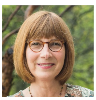
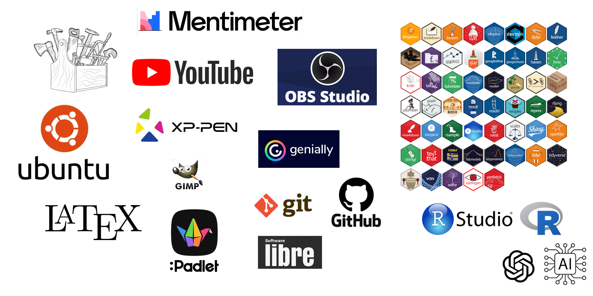

```{r setup, include=FALSE}
options(htmltools.dir.version = FALSE)
knitr::opts_chunk$set(
fig.width=9, fig.height=3.5, fig.retina=3,
out.width = "100%",
cache = FALSE,
echo = TRUE,
message = FALSE, 
warning = FALSE,
hiline = TRUE
)
c1="#B9D1EA"
C2="#618ABB"
C3="#00235e"
C4="#FDBA21"

C5="#134074"
C6="#8DA9C4"
C7="#EEF4ED"
#B9D1EA

```


```{r xaringan-themer, include=FALSE, warning=FALSE}
library(xaringanthemer)
style_duo_accent(
primary_color = C3, #"#1381B0", # texto primario
secondary_color = C3, # "#FF961C", # texto secundario
inverse_header_color = C7)     # "#FFFFFF" # texto inverso
```

class: middle

.pull-left[ 
# Agenda

## Antecedentes
## Proceso de diseño y construcción
## Puesta en marcha

]

.pull-right[
```{r, echo=FALSE, out.width="100%", fig.align = "center"}

```
]

---
# Antecedentes

```{r echo = FALSE}
# remotes::install_github("gadenbuie/xaringanExtra")
xaringanExtra::use_panelset()
```
.panelset[
.panel[.panel-name[Comunicación]
### La forma de comunicarnos cambia de manera acelerada


]
<!------------------------------------------------------------------- -->panel-name[Ayer-Hoy]
.panel[.panel-name[Liz R]
### LIZ REISBERG

.left-column[

]
.right-column[
Consultora internacional en educación superior y política educativa. Doctorada en Educación Internacional y Comparada de la Universidad de Stanford.
+ No podemos criar a nuestros hijos, como nos criaron a nosotros...
+ Hay que hacer la pregunta clave... 
+ Los estudiantes aprenden mejor cuando están activamente involucrados en el proceso de aprendizaje, participando en actividades significativas y desafiantes.
+ Fomenta el trabajo en equipo y la colaboración entre los estudiantes, creyendo que el aprendizaje es un proceso social que se beneficia de la interacción con otros.
+ Reconoce que cada estudiante es único y aboga por enfoques de enseñanza que se adapten a las necesidades individuales de cada alumno.
+ Valora el uso de la tecnología como una herramienta poderosa para mejorar la educación, permitiendo nuevas formas de aprender y enseñar.

Visitó la PUJCL en 2018 : “La nueva dinámica del aula: la Enseñanza y el Aprendizaje para los millennials” (jun/2018)
]
]

<!------------------------------------------------------------------- -->
.panel[.panel-name[Liz-tipos problemas]
.pull-left[
Tipo 1 :  Cuantos triángulos hay?


]

.pull-right[
Tipo 2 :  Dilema del tren 
¿Qué harías?

]

]

.panel[.panel-name[Tecnología]
### Las herramientas tecnológicas son una ayuda, no un propósito
<center>

</center>
]
<!------------------------------------------------------------------- -->
.panel[.panel-name[Mis problemas]


]
<!------------------------------------------------------------------- -->
.panel[.panel-name[Probabilidad y Estadística]

.pull-left[

### Programas
* Ingeniería Civil (ABET)
* Ingeniería de Sistemas (ABET)
* Ingeniería Electrónica (ABET)
* Matemáticas
* Biología
* Ingeniería Mecánica
* Ingeniería Biomédica

### Requerimientos carreras 
* Énfasis en computo
* ABET : ABCDE....K
]

.pull-right[

### Contenido
* Estadística descriptiva
* Probabilidad
* Variable aleatoria
* Inferencia estadística
* Regresión lineal

### Lineamientos académicos
* 3 parciales 60%;  3 quices 20%; * 1 proyecto 20% 
* Evaluaciones escritas
* 30% 70% 100%
* Semana 5-6, 11-12, 17-18
* 4to, 5to semestre, prerrequisitos diferentes...
]

]
<!------------------------------------------------------------------- -->
]
<!------------------------------------------------------------------- -->
<!------------------------------------------------------------------- -->
---
## Proceso de diseño y construcción
### Javevirtual - Magis


* Andrea Serena, Carlos Murillas, Javier Delgado, David Mejía, Adriana Morales, Santiago Valencia,  Natalia Colmenares,  Donovan Del Valle,  Ana Murillo, Tatiana Valencia, ... 

<!------------------------------------------------------------------- -->

---
class: middle

.pull-left[
## Aula invertida - flipped classroom

> Es un modelo de aprendizaje semi presencial o mixto, el cual tiene el objetivo hacer clases más dinámicas para motivar a los alumnos, al combinar los proyectos en clase con trabajos en casa.

> https://www.ispring.es/

]
.pull-right[
```{r, echo=FALSE, warning=FALSE, message=FALSE, fig.height=10}
source("R/nube1.R")
```
]


---
## Proceso de diseño y construcción


[Plantilla](https://javerianacaliedu-my.sharepoint.com/:x:/r/personal/dgonzalez_javerianacali_edu_co/_layouts/15/Doc.aspx?sourcedoc=%7BD9CF1411-022E-44ED-894B-3DD0FBFCE802%7D&file=Estructuracion%20objetivos%20PyE%202017-2.xlsx&action=default&mobileredirect=true)
<!------------------------------------------------------------------- -->
---
## Puesta en marcha
### Curso de PyE

<center>

</center>
<!------------------------------------------------------------------- -->

---
## Requerimientos


---
## Dinámica del curso


.pull-left[

#### Sesión 1 :Presentación de la guía

* Presentación de la guía y de los recursos de la unidad
* Introducción al tema

#### Sesión 2 : Trabajo en clase

* Se responden preguntas sobre problemas presentados / se hacen preguntas 
* Se continua con el desarrollo de las actividades planteadas 

#### Sesión 3 : Trabajo en sala de computo

* Se continúa con las actividades 
* Se rotan la sesión con un monitor que acompaña las practicas en PC

]

.pull-right[
**Nota** : 
* El material está disponible un día antes de la primera sesión
* En semana de exámenes no se adiciona tema
* Se emplea R- RStudio para el desarrollo de las actividades
* Se emplea la plataforma Brightspace para el recibo y la evaluación de las actividades
* El proceso del curso ha tenido el acompañamiento y seguimiento del MAGIS
* Tomo fotos y construyo mosaico con el nombre de los estudiantes

<br/>

<center>

</center>
]
---
## Curso  en GitHub

<center>

</center>

[Web-PyE 2023-2](https://dgonxalex80.github.io/probabilidad20232/)

---
## Curso en Brightspace
<center>

</center>
[Web-PyE 2023-2](https://dgonxalex80.github.io/probabilidad20232/)

---
class: center middle

# **Preguntas**

---
class: center middle

# **Gracias**

Daniel Enrique González Gómez <br/>
dgonzalez@javerianacali.edu.co

---
# Enlaces


